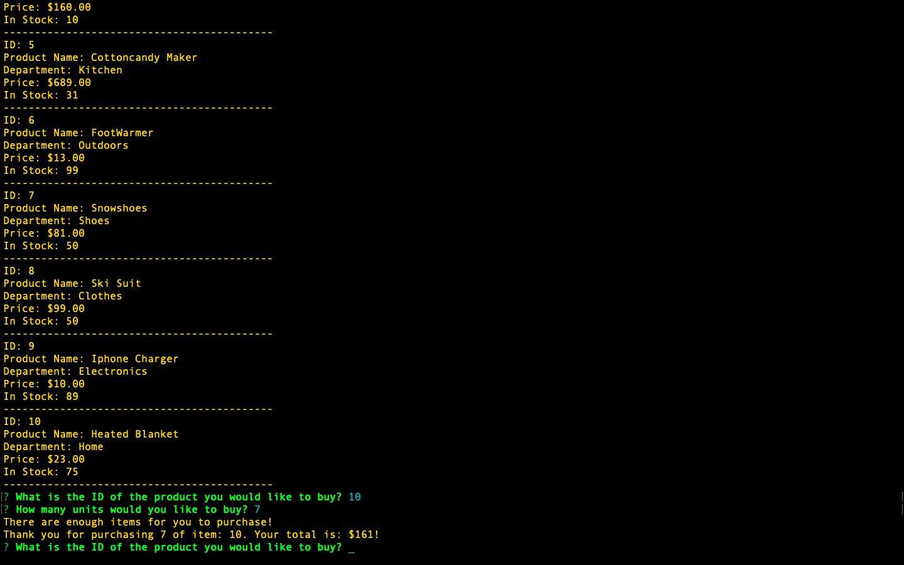
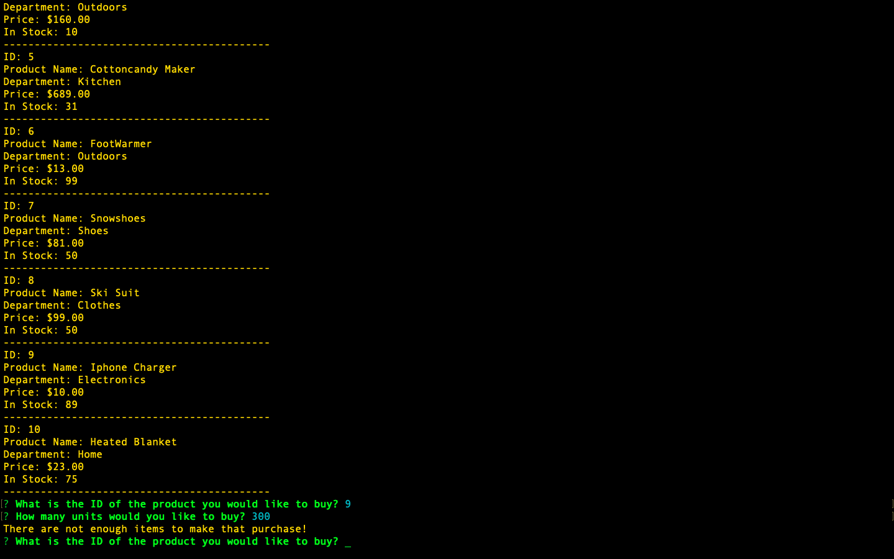

# Node.js-MySQL

### Introduction

* I created an Amazon-like storefront app, called Bamazon, using MySQL, the MySQL NPM Package, and the Prompt Package.
* This app takes in orders from customers and deplete from the store's total supplies.
* The app first displays a list of all of the available products, their costs, and current stock.

* The app asks the following things from the user.

	1. product ID
	2. the amount the user wants to purchase
    3. sucessful purchase

* when there are not enough in stock.

